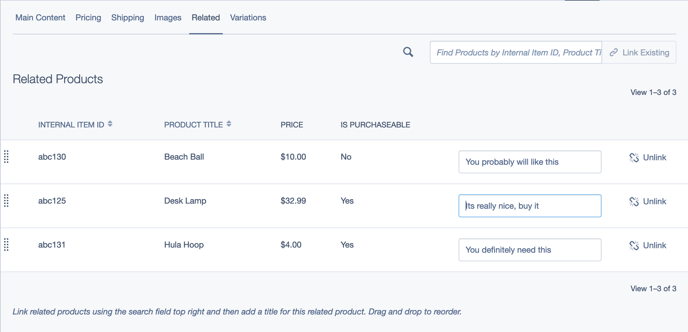

# SilverShop Related Products
SilverShop submodule which allows you to specify related products for any Buyable

Based on [markguinn/silverstripe-related_products](https://github.com/markguinn/silverstripe-related_products).  Thank you.

## Features
* Add a list of related product to each product and provide a list to a template via an include
* Localisation options

## Requirements
* [SilverShop](https://github.com/silvershop/silvershop-core)
* [symbiote/silverstripe-gridfieldextensions](https://github.com/symbiote/silverstripe-gridfieldextensions)

## Documentation
[Index](/docs/en/index.md)

## Support
None sorry.

## Change Log
[File](changelog.md)

## License
[MIT](LICENSE)
